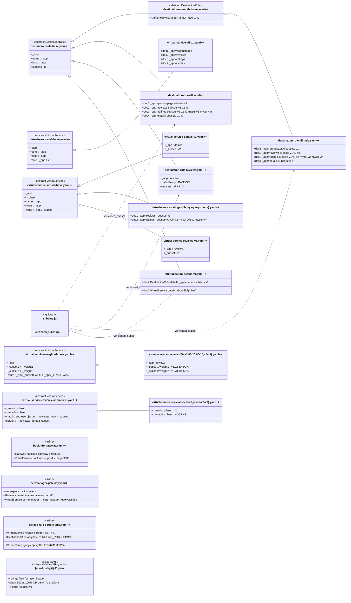

# Class Diagram: samples/bookinfo/.refactoring/refactored/networking

> `$extends` relationships are shown as inheritance arrows (`◁──`).
> jq library usage is shown as dependency arrows (`‥‥▷`).
> Files containing multiple `---`-separated documents list per-doc parameter
> bindings inline; all documents within a file share the same base.
> Files using the `@01.yaml` naming convention bypass jq++ and are marked
> `<<plain YAML>>`.

