# Class Diagram: samples/bookinfo/networking/.refactoring/refactored

> `$extends` relationships are shown as inheritance arrows (`◁──`).
> jq function-library usage is shown as dependency arrows (`‥‥▷`).
> Files containing multiple `---`-separated documents list each doc's bindings
> inline; all documents within a file share the same base pattern unless noted.

```mermaid
classDiagram
    direction LR

    %% ── jq function library ──────────────────────────────────────────────
    %% class specJq["spec.jq"] {
    %%     <<jq library>>
    %%     +subset_of(v)
    %%     +http_port(n)
    %%     +https_port(n)
    %%     +routing_destination(sub)
    %% }

    %% ── bases derived from spec.jq ───────────────────────────────────────
    class gatewayBase["gateway-base.yaml++"] {
        <<abstract Gateway>>
        +selector : istio=ingressgateway
        +servers : []
    }
    class drBase["destination-rule-base.yaml++"] {
        <<abstract DestinationRule>>
        +_svc
        +name : _svc
        +host : _svc
        +subsets : []
    }
    class tsAll["traffic-split/all.yaml++"] {
        <<http route mixin>>
        +_subset
        +http : route → routing_destination(_subset)
    }
    class tsAB["traffic-split/ab-testing.yaml++"] {
        <<http route mixin>>
        +_traffic_split : name+weight × 2
        +http : dest[0] w% + dest[1] w%
    }

    %% ── standalone bases ─────────────────────────────────────────────────
    class vsBase["virtual-service-base.yaml++"] {
        <<abstract VirtualService>>
        +_svc
        +name : _svc
        +hosts : _svc
        +http : []
    }
    class policyMtls["policy/mtls.yaml++"] {
        <<mixin>>
        +trafficPolicy.tls.mode : ISTIO_MUTUAL
    }
    class subsProductpage["subsets/productpage.yaml++"] {
        <<subsets mixin>>
        +subsets : v1
    }
    class subsReviews["subsets/reviews.yaml++"] {
        <<subsets mixin>>
        +subsets : v1 v2 v3
    }
    class subsRatings["subsets/ratings.yaml++"] {
        <<subsets mixin>>
        +subsets : v1 v2 v2-mysql v2-mysql-vm
    }
    class subsDetails["subsets/details.yaml++"] {
        <<subsets mixin>>
        +subsets : v1 v2
    }

    %% ── leaf files ───────────────────────────────────────────────────────
    class bookinfoGW["bookinfo-gateway.yaml++"] {
        +doc1 Gateway bookinfo-gateway
        +port : http_port(8080)
        +doc2 VirtualService bookinfo (inline)
        +destination : productpage port 9080
    }
    class certManagerGW["certmanager-gateway.yaml++"] {
        +namespace : istio-system
        +doc1 Gateway cert-manager-gateway
        +port : http_port(80)
        +doc2 VirtualService cert-manager (inline)
        +destination : cert-manager-resolver port 8089
    }
    class drAll["destination-rule-all.yaml++"] {
        +doc1 _svc=productpage
        +doc2 _svc=reviews
        +doc3 _svc=ratings
        +doc4 _svc=details
    }
    class drAllMtls["destination-rule-all-mtls.yaml++"] {
        +doc1 _svc=productpage
        +doc2 _svc=reviews
        +doc3 _svc=ratings
        +doc4 _svc=details
    }
    class drReviews["destination-rule-reviews.yaml++"] {
        +_svc : reviews
        +trafficPolicy : RANDOM
    }
    class egressApis["egress-rule-google-apis.yaml++"] {
        +doc1 ServiceEntry googleapis (http_port https_port)
        +doc2 VirtualService rewrite-port (inline)
        +doc3 DestinationRule originate-tls (inline)
    }
    class faultDetails["fault-injection-details-v1.yaml++"] {
        +doc1 VirtualService details
        +http : abort 555 + routing_destination(v1)
        +doc2 DestinationRule details
        +subsets : subset_of(v1)
    }
    class vsAllV1["virtual-service-all-v1.yaml++"] {
        +_svc : productpage reviews ratings details
        +_subset : v1
    }
    class vsDetailsV2["virtual-service-details-v2.yaml++"] {
        +_svc : details
        +_subset : v2
    }
    class vsRatingsSubset["virtual-service-ratings-{db,mysql,mysql-vm}.yaml++"] {
        +doc1 _svc=reviews _subset=v3
        +doc2 _svc=ratings _subset=v2 OR v2-mysql OR v2-mysql-vm
    }
    class vsRatingsFault["virtual-service-ratings-test-{abort,delay}.yaml++"] {
        +_svc : ratings
        +match : end-user=jason
        +fault : abort 500 OR delay 7s
        +default : routing_destination(v1)
    }
    class vsReviewsV3["virtual-service-reviews-v3.yaml++"] {
        +_svc : reviews
        +_subset : v3
    }
    class vsReviewsWeighted["virtual-service-reviews-{50-v3,80-20,90-10,v2-v3}.yaml++"] {
        +_svc : reviews
        +_traffic_split : name+weight × 2
    }
    class vsReviewsJason["virtual-service-reviews-{test-v2,jason-v2-v3}.yaml++"] {
        +_svc : reviews
        +match : end-user=jason → routing_destination(v2)
        +default : routing_destination(v1 OR v3)
    }

    %% ── spec.jq → derived bases ──────────────────────────────────────────
    %% specJq <|-- gatewayBase
    %% specJq <|-- drBase
    %% specJq <|-- tsAll
    %% specJq <|-- tsAB

    %% ── Gateway hierarchy ────────────────────────────────────────────────
    gatewayBase <|-- bookinfoGW
    gatewayBase <|-- certManagerGW

    %% ── VirtualService: single-destination (traffic-split/all) ───────────
    vsBase <|-- vsAllV1
    tsAll  <|-- vsAllV1

    vsBase <|-- vsDetailsV2
    tsAll  <|-- vsDetailsV2

    vsBase <|-- vsRatingsSubset
    tsAll  <|-- vsRatingsSubset

    vsBase <|-- vsReviewsV3
    tsAll  <|-- vsReviewsV3

    %% ── VirtualService: weighted (traffic-split/ab-testing) ─────────────
    vsBase <|-- vsReviewsWeighted
    tsAB   <|-- vsReviewsWeighted

    %% ── VirtualService: inline http (uses spec.jq functions directly) ────
    vsBase <|-- vsRatingsFault
    %% specJq ..> vsRatingsFault : routing_destination

    vsBase <|-- vsReviewsJason
    %% specJq ..> vsReviewsJason : routing_destination

    vsBase <|-- faultDetails
    %% specJq ..> faultDetails : routing_destination subset_of

    %% specJq ..> egressApis : http_port https_port

    %% ── DestinationRule: no mTLS ─────────────────────────────────────────
    drBase        <|-- drAll
    subsProductpage <|-- drAll
    subsReviews   <|-- drAll
    subsRatings   <|-- drAll
    subsDetails   <|-- drAll

    %% ── DestinationRule: mTLS ────────────────────────────────────────────
    drBase        <|-- drAllMtls
    policyMtls    <|-- drAllMtls
    subsProductpage <|-- drAllMtls
    subsReviews   <|-- drAllMtls
    subsRatings   <|-- drAllMtls
    subsDetails   <|-- drAllMtls

    %% ── DestinationRule: reviews with RANDOM LB ──────────────────────────
    drBase      <|-- drReviews
    subsReviews <|-- drReviews

    %% ── DestinationRule: fault-injection pair ────────────────────────────
    drBase <|-- faultDetails
```

