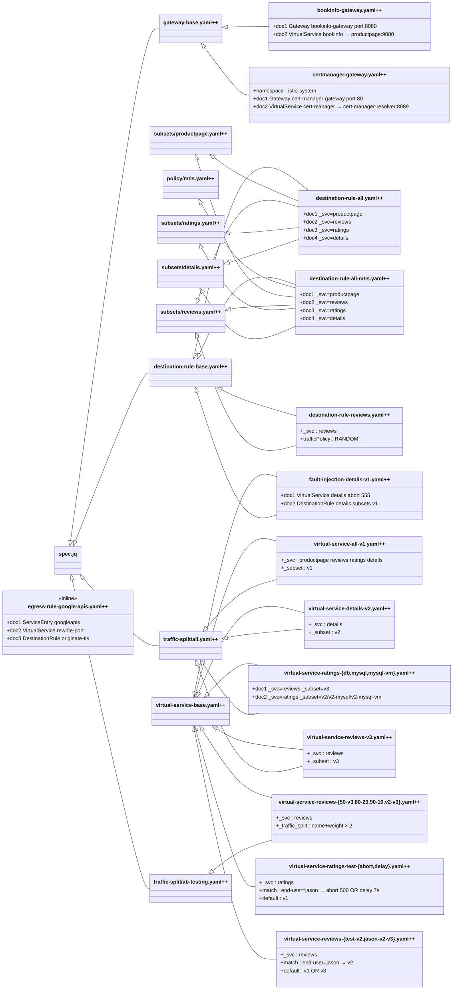

# Class Diagram: samples/bookinfo/networking/.refactoring/refactored

> Leaf files and their base dependencies.
> `$extends` relationships are shown as inheritance arrows (`◁──`).
> Base node details (attributes, jq functions) are in [shared/CLASS_DIAGRAM.md](shared/CLASS_DIAGRAM.md).

