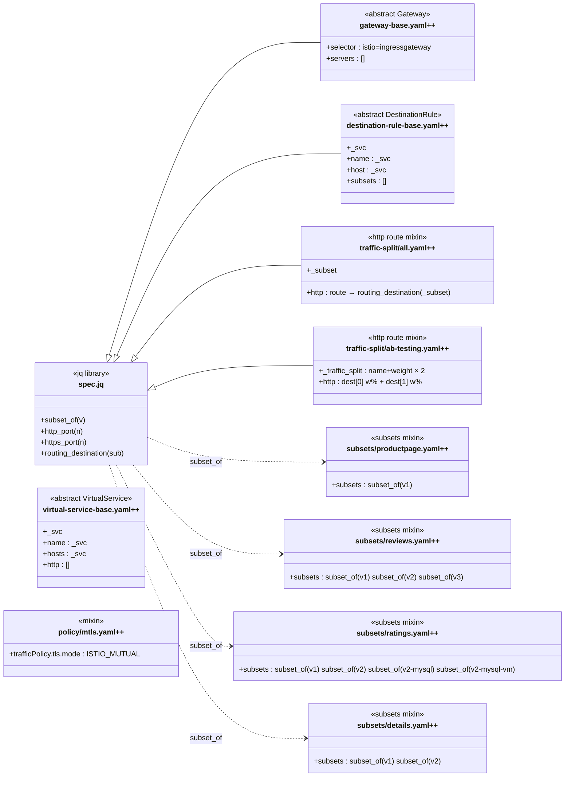

# Class Diagram: samples/bookinfo/networking/.refactoring/refactored/shared

> This directory contains only reusable bases and mixins — no leaf files.
> `$extends` relationships are shown as inheritance arrows (`◁──`).
> jq function-library usage (via `eval:object:<ns>::<fn>`) is shown as
> dependency arrows (`‥‥▷`).

