# Class Diagram: samples/bookinfo/networking

> Many VirtualService files in this directory are _alternative_ routing scenarios
> for the same service host — not resources deployed simultaneously.
> Each named host is represented as a single class; its per-file routing variants
> are listed as labelled attributes.

```mermaid
classDiagram
    direction LR

    namespace Gateways {
        class bookinfoGW["bookinfo-gateway"] {
            <<Gateway>>
            +selector : istio=ingressgateway
            +port : 8080 / HTTP
            +hosts : *
        }
        class certManagerGW["cert-manager-gateway"] {
            <<Gateway>>
            +namespace : istio-system
            +selector : istio=ingressgateway
            +port : 80 / HTTP
            +hosts : *
        }
    }

    namespace VirtualServices {
        class vsBookinfo["bookinfo"] {
            <<VirtualService>>
            +hosts : *
            +gateways : bookinfo-gateway
            +match : /productpage /static /login /logout /api/v1/products
            +destination : productpage port 9080
        }
        class vsCertManager["cert-manager"] {
            <<VirtualService>>
            +namespace : istio-system
            +hosts : *
            +gateways : cert-manager-gateway
            +match : /.well-known/acme-challenge/
            +destination : cert-manager-resolver port 8089
        }
        class vsProductpage["productpage"] {
            <<VirtualService>>
            +hosts : productpage
            +all-v1 : route subset v1
        }
        class vsDetails["details"] {
            <<VirtualService>>
            +hosts : details
            +all-v1 : route subset v1
            +v2 : route subset v2
            +fault-inject : abort 555 for all / fallback v1
        }
        class vsRatings["ratings"] {
            <<VirtualService>>
            +hosts : ratings
            +all-v1 : route subset v1
            +db : reviews→v3 / ratings→v2
            +mysql : reviews→v3 / ratings→v2-mysql
            +mysql-vm : reviews→v3 / ratings→v2-mysql-vm
            +test-abort : abort 500 for jason / fallback v1
            +test-delay : delay 7s for jason / fallback v1
        }
        class vsReviews["reviews"] {
            <<VirtualService>>
            +hosts : reviews
            +all-v1 : route subset v1
            +v3 : route subset v3
            +50-v3 : v1 50% + v3 50%
            +80-20 : v1 80% + v2 20%
            +90-10 : v1 90% + v2 10%
            +v2-v3 : v2 50% + v3 50%
            +test-v2 : jason→v2 / default→v1
            +jason-v2-v3 : jason→v2 / default→v3
        }
        class vsGoogleapis["rewrite-port-for-googleapis"] {
            <<VirtualService>>
            +hosts : www.googleapis.com
            +match port 80 : route to port 443
        }
    }

    namespace DestinationRules {
        class drAll["destination-rule-all"] {
            <<DestinationRule>>
            +productpage : subsets v1
            +reviews : subsets v1 v2 v3
            +ratings : subsets v1 v2 v2-mysql v2-mysql-vm
            +details : subsets v1 v2
        }
        class drAllMtls["destination-rule-all-mtls"] {
            <<DestinationRule>>
            +trafficPolicy : ISTIO_MUTUAL
            +productpage : subsets v1
            +reviews : subsets v1 v2 v3
            +ratings : subsets v1 v2 v2-mysql v2-mysql-vm
            +details : subsets v1 v2
        }
        class drReviews["destination-rule-reviews"] {
            <<DestinationRule>>
            +host : reviews
            +trafficPolicy : RANDOM
            +subsets : v1 v2 v3
        }
        class drDetailsFI["details (fault-injection-details-v1)"] {
            <<DestinationRule>>
            +host : details
            +subsets : v1
        }
        class drGoogleapis["originate-tls-for-googleapis"] {
            <<DestinationRule>>
            +host : www.googleapis.com
            +trafficPolicy : ROUND_ROBIN
            +port 443 : SIMPLE TLS
        }
    }

    namespace ServiceEntries {
        class seGoogleapis["googleapis"] {
            <<ServiceEntry>>
            +hosts : www.googleapis.com
            +port 80 : HTTP
            +port 443 : HTTPS
            +resolution : DNS
        }
    }

    %% Gateway attachments
    vsBookinfo --> bookinfoGW : gateways
    vsCertManager --> certManagerGW : gateways

    %% Mesh VS → DestinationRule subset routing
    vsProductpage ..> drAll : subsets
    vsDetails ..> drAll : subsets
    vsRatings ..> drAll : subsets
    vsReviews ..> drAll : subsets

    %% drAllMtls is a drop-in alternative to drAll when mTLS is required
    drAllMtls -- drAll : alternative

    %% drReviews adds RANDOM load balancing for reviews (replaces drAll reviews entry)
    vsReviews ..> drReviews : subsets (alternative)

    %% fault-injection-details-v1: vsDetails + drDetailsFI are deployed together
    vsDetails ..> drDetailsFI : fault-injection-details-v1

    %% Egress group
    vsGoogleapis --> seGoogleapis : routes to
    drGoogleapis --> seGoogleapis : applies to host
```

